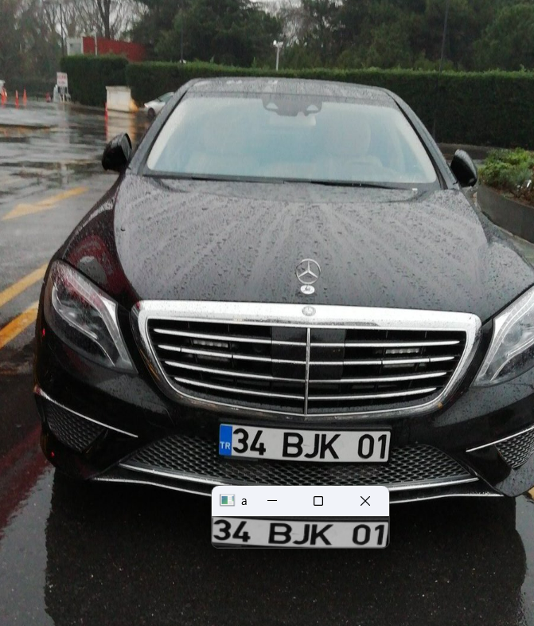
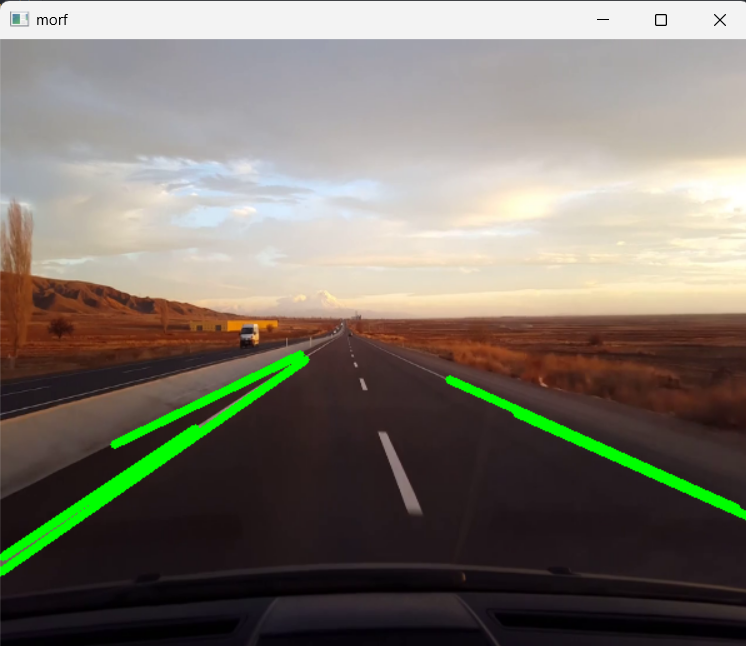
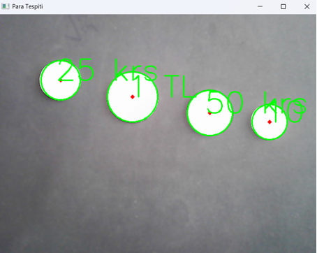

# Python ile Görüntü İşleme / İmage Processing With Python

TR \
Python ile Görüntü İşleme alanında temel işlemler ve örneklerini yaptığım bir depodur.

EN \
It is a repository where I do basic operations and examples in the field of Image Processing with Python.


## Çıktılar/Outputs









  
## Kütüphaneler/Libraries

- numpy
- opencv-python
- pytesseract
- matplotlib
- mediapipe

  
## Bilgisayarınızda Çalıştırın / Run

Projeyi klonlayın

```bash
  git clone https://github.com/enesacarq/image-processing-withPython/tree/main
```

Proje dizinine gidin

```bash
  cd image-processing-withPython
```

Gerekli paketleri yükleyin

```bash
  pip install -r requirements.txt
```
Örnek kod çalıştırma

```bash
   python python_kodlari\57_yüz_landmark_cikarma.py
```
  
## Lisans/Licence

[MIT](https://choosealicense.com/licenses/mit/)

  
